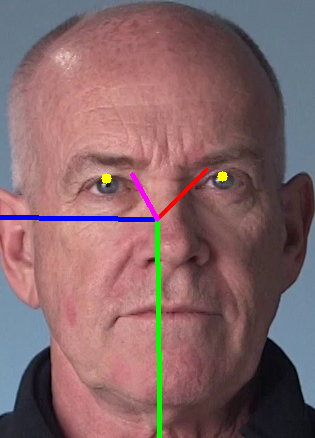

# Computer Pointer Controller

Computer Pointer Controller in an application that enables automatic control of
computer pointer with use of human eye gaze direction. Application supports
following inputs:

1. Image file,
2. Video file,
3. Camera video stream.



## Project Set Up and Installation

Project is based on
[Intel OpenVINO 2020.1](https://docs.openvinotoolkit.org/2020.1/index.html)
toolkit so make sure it is installed before moving on.

Project installation procedure is following:

```
$ git clone https://github.com/marcin-sielski/computer-pointer-controller.git
$ cd computer-pointer-controller
$ ./install.sh
```  

Project removal procedure is following:

__Note:__ Make sure to exit virtual environment before moving on.

```
$ ./uninstall.sh
```

## Demo

In order to execute the demo make sure the project is properly installed and
the commands are executed in virtual environment.

__Note:__ Enter the virtual environment by executing:

```
$ cd src
$ pipenv shell

```

Project supports number of bash scripts that simplifies execution of the demo:

- `./control_pointer_with_camera.sh` - executes demo with video input from the
camera stream,
- `./control_pointer_with_image.sh` - executes demo with input from image file,
- `./control_pointer_with_video.sh` - executes demo with input from video file.

## Documentation

Computer Pointer Controller supports number of parameters that enables:

- support of various input sources,
- benchmarking,
- extended logging,
- debugging,
- enhancing inference performance.

```
$ python3 computer_pointer_controller.py --help
usage: computer_pointer_controller.py [-h] -i INPUT [-o OUTPUT] [-d DEVICE]
                                      [-g [DEBUG]] [-p [PROFILER]]
                                      [-q [PRECISION]] [-l [LOGLEVEL]]
                                      [-s [SILENT]]

optional arguments:
  -h, --help            show this help message and exit
  -i INPUT, --input INPUT
                        select input path to the image or video file or
                        specify camera pipeline
  -o OUTPUT, --output OUTPUT
                        specify the file where to store image generated by -g
                        1234
  -d DEVICE, --device DEVICE
                        specify the target device for selected model to infer
                        on to get performance gain: CPU, GPU, FPGA or MYRIAD
                        (CPU by default). Most of the models must be run on
                        CPU anyway
  -g [DEBUG], --debug [DEBUG]
                        enable debug mode for specified models (1 by default):
                        1 - face detection (mandatory), 2 - head pose
                        estimation (optional), 3 - facial landmarks detection
                        (optional), 4 - gaze estimation (optional)
  -p [PROFILER], --profiler [PROFILER]
                        enable profiler (False by default)
  -q [PRECISION], --precision [PRECISION]
                        force to use selected precision for some models
                        (FP32-INT8 by default): FP16 - half precision floating
                        point format, FP32 - single precision floating point
                        format, FP32-INT8 - 8-bit precision integer format.
  -l [LOGLEVEL], --loglevel [LOGLEVEL]
                        enable log level (INFO by default): NOTSET, DEBUG,
                        INFO, WARNING, ERROR, CRITICAL
  -s [SILENT], --silent [SILENT]
                        enable silent mode (False by default)
```

## Benchmarks

The benchmark tests were executed on the system equipped with:

- Intel(R) Core(TM) i5-3360M CPU @ 2.80GHz
- 16 GB of RAM,
- Intel Neural Compute Stick 2 attached over USB 2.0 port.

The goal of following benchmark tests is to find out the best parameters that leads to the shortest inference time for the single loop.

1. Benchmark with use of default parameters (reference)

    ```
   $ ./control_pointer_with_image.sh -p
   Press 'esc' to exit
   Total loading time of the models: 0.45763206481933594 s
   Average inference time: 0.08859419822692871 s
   Frames per second: 11.287420847114166
   Timer unit: 1e-06 s

   Total time: 0.787844 s
   File: computer_pointer_controller.py
   Function: run at line 226

   Line #      Hits         Time  Per Hit   % Time  Line Contents
   ==============================================================
   ...
      246                                           # ----- Models Load ------------------------------------------------------------
      247         1     197870.0 197870.0     25.1          faceDetection = ModelFaceDetection()
      248         1      64283.0  64283.0      8.2          facialLanmarksDetection = ModelFacialLandmarksDetection(precision=args.precision)
      249         1      89098.0  89098.0     11.3          headPoseEstimation = ModelHeadPoseEstimation(device=args.device, precision=args.precision)
      250         1     106334.0 106334.0     13.5          gazeEstimation = ModelGazeEstimation(precision=args.precision)
      251                                           # ------------------------------------------------------------------------------
   ...
      269                                           # ----- Inference --------------------------------------------------------------
      270         1      11780.0  11780.0      1.5              faceDetection.inputs(frame) # GFlops 0.611
      271         1      55724.0  55724.0      7.1              faceDetection.wait()
      272         1       1752.0   1752.0      0.2              outputs = faceDetection.outputs()
      273         1          5.0      5.0      0.0              if len(outputs) == 0:
      274                                                           logging.warning('No face detected')
      275                                                           continue
      276         1          2.0      2.0      0.0              if len(outputs) > 1:
      277                                                           logging.warning('More then one face detected')
      278         1          4.0      4.0      0.0              if outputs[0].shape[0] == 0 or outputs[0].shape[1] == 0 or \
      279         1          3.0      3.0      0.0                  outputs[0].shape[2] < 3:
      280                                                           logging.warning('Image too small')
      281                                                           continue
      282
      283         1       1458.0   1458.0      0.2              headPoseEstimation.inputs(outputs[0]) # GFlops 0.105
      284         1       1107.0   1107.0      0.1              facialLanmarksDetection.inputs(outputs[0]) # GFlops 0.021
      285
      286         1       4500.0   4500.0      0.6              facialLanmarksDetection.wait()
      287         1       2065.0   2065.0      0.3              outputs = facialLanmarksDetection.outputs()
      288         1          5.0      5.0      0.0              if outputs[0].shape[0] == 0 or outputs[0].shape[1] == 0 or \
      289         1          3.0      3.0      0.0                  outputs[0].shape[2] < 3 or outputs[1].shape[0] == 0 or \
      290         1          3.0      3.0      0.0                  outputs[1].shape[1] == 0 or outputs[1].shape[2] < 3:
      291                                                           logging.warning('Image too small')
      292                                                           continue
      293         1         40.0     40.0      0.0              headPoseEstimation.wait()
      294         1       1234.0   1234.0      0.2              outputs.append(headPoseEstimation.outputs())
      295
      296         1        650.0    650.0      0.1              gazeEstimation.inputs(outputs) # GFlops 0.139
      297         1       7402.0   7402.0      0.9              gazeEstimation.wait()
      298         1        758.0    758.0      0.1              outputs = gazeEstimation.outputs()
      299                                           # ------------------------------------------------------------------------------
   ...
   ```

2. Benchmark with use of FP32-INT8 precision for selected models executed on
CPU:

   ```
   $ ./control_pointer_with_image.sh -p -q FP32-INT8
   Press 'esc' to exit
   Total loading time of the models: 0.4643588066101074 s
   Average inference time: 0.08828258514404297 s
   Frames per second: 11.327262317572458
   Timer unit: 1e-06 s

   Total time: 0.846542 s
   File: computer_pointer_controller.py
   Function: run at line 226

   Line #      Hits         Time  Per Hit   % Time  Line Contents
   ==============================================================
   ...
      246                                           # ----- Models Load ------------------------------------------------------------
      247         1     197218.0 197218.0     23.3          faceDetection = ModelFaceDetection()
      248         1      67762.0  67762.0      8.0          facialLanmarksDetection = ModelFacialLandmarksDetection(precision=args.precision)
      249         1      88921.0  88921.0     10.5          headPoseEstimation = ModelHeadPoseEstimation(device=args.device, precision=args.precision)
      250         1     110412.0 110412.0     13.0          gazeEstimation = ModelGazeEstimation(precision=args.precision)
      251                                           # ------------------------------------------------------------------------------
   ...
      269                                           # ----- Inference --------------------------------------------------------------
      270         1      11255.0  11255.0      1.3              faceDetection.inputs(frame) # GFlops 0.611
      271         1      54881.0  54881.0      6.5              faceDetection.wait()
      272         1       1670.0   1670.0      0.2              outputs = faceDetection.outputs()
      273         1          3.0      3.0      0.0              if len(outputs) == 0:
      274                                                           logging.warning('No face detected')
      275                                                           continue
      276         1          2.0      2.0      0.0              if len(outputs) > 1:
      277                                                           logging.warning('More then one face detected')
      278         1          4.0      4.0      0.0              if outputs[0].shape[0] == 0 or outputs[0].shape[1] == 0 or \
      279         1          3.0      3.0      0.0                  outputs[0].shape[2] < 3:
      280                                                           logging.warning('Image too small')
      281                                                           continue
      282
      283         1       1485.0   1485.0      0.2              headPoseEstimation.inputs(outputs[0]) # GFlops 0.105
      284         1       1099.0   1099.0      0.1              facialLanmarksDetection.inputs(outputs[0]) # GFlops 0.021
      285
      286         1       5333.0   5333.0      0.6              facialLanmarksDetection.wait()
      287         1       1930.0   1930.0      0.2              outputs = facialLanmarksDetection.outputs()
      288         1          5.0      5.0      0.0              if outputs[0].shape[0] == 0 or outputs[0].shape[1] == 0 or \
      289         1          4.0      4.0      0.0                  outputs[0].shape[2] < 3 or outputs[1].shape[0] == 0 or \
      290         1          3.0      3.0      0.0                  outputs[1].shape[1] == 0 or outputs[1].shape[2] < 3:
      291                                                           logging.warning('Image too small')
      292                                                           continue
      293         1        673.0    673.0      0.1              headPoseEstimation.wait()
      294         1       1409.0   1409.0      0.2              outputs.append(headPoseEstimation.outputs())
      295
      296         1        697.0    697.0      0.1              gazeEstimation.inputs(outputs) # GFlops 0.139
      297         1       6675.0   6675.0      0.8              gazeEstimation.wait()
      298         1       1046.0   1046.0      0.1              outputs = gazeEstimation.outputs()
      299                                           # ------------------------------------------------------------------------------
   ...
   ```

3. Benchmark with use of FP32-INT8 precision for selected models executed on CPU
and one model offloaded to VPU device:

   ```
   $ ./control_pointer_with_image.sh -p -q FP32-INT8 -d MYRIAD
   Press 'esc' to exit
   2020-05-17 14:42:04,321 WARNING: Unsupported layers found: ['data', 'angle_y_fc/flatten_fc_input/Cast_14125_const', 'angle_r_fc/flatten_fc_input/Cast_14127_const', 'angle_p_fc/flatten_fc_input/Cast_14129_const']
   Total loading time of the models: 2.0119919776916504 s
   Average inference time: 0.08335280418395996 s
   Frames per second: 11.997196852465768
   Timer unit: 1e-06 s

   Total time: 2.36192 s
   File: computer_pointer_controller.py
   Function: run at line 226

   Line #      Hits         Time  Per Hit   % Time  Line Contents
   ==============================================================
   ...
      246                                           # ----- Models Load ------------------------------------------------------------
      247         1     202421.0 202421.0      8.6          faceDetection = ModelFaceDetection()
      248         1      75371.0  75371.0      3.2          facialLanmarksDetection = ModelFacialLandmarksDetection(precision=args.precision)
      249         1    1629757.0 1629757.0     69.0          headPoseEstimation = ModelHeadPoseEstimation(device=args.device, precision=args.precision)
      250         1     104400.0 104400.0      4.4          gazeEstimation = ModelGazeEstimation(precision=args.precision)
      251                                           # ------------------------------------------------------------------------------
   ...
      269                                           # ----- Inference --------------------------------------------------------------
      270         1       9310.0   9310.0      0.4              faceDetection.inputs(frame) # GFlops 0.611
      271         1      56626.0  56626.0      2.4              faceDetection.wait()
      272         1       1148.0   1148.0      0.0              outputs = faceDetection.outputs()
      273         1          2.0      2.0      0.0              if len(outputs) == 0:
      274                                                           logging.warning('No face detected')
      275                                                           continue
      276         1          1.0      1.0      0.0              if len(outputs) > 1:
      277                                                           logging.warning('More then one face detected')
      278         1          3.0      3.0      0.0              if outputs[0].shape[0] == 0 or outputs[0].shape[1] == 0 or \
      279         1          1.0      1.0      0.0                  outputs[0].shape[2] < 3:
      280                                                           logging.warning('Image too small')
      281                                                           continue
      282
      283         1        986.0    986.0      0.0              headPoseEstimation.inputs(outputs[0]) # GFlops 0.105
      284         1       1675.0   1675.0      0.1              facialLanmarksDetection.inputs(outputs[0]) # GFlops 0.021
      285
      286         1        940.0    940.0      0.0              facialLanmarksDetection.wait()
      287         1       2159.0   2159.0      0.1              outputs = facialLanmarksDetection.outputs()
      288         1          7.0      7.0      0.0              if outputs[0].shape[0] == 0 or outputs[0].shape[1] == 0 or \
      289         1          5.0      5.0      0.0                  outputs[0].shape[2] < 3 or outputs[1].shape[0] == 0 or \
      290         1          4.0      4.0      0.0                  outputs[1].shape[1] == 0 or outputs[1].shape[2] < 3:
      291                                                           logging.warning('Image too small')
      292                                                           continue
      293         1         45.0     45.0      0.0              headPoseEstimation.wait()
      294         1       1279.0   1279.0      0.1              outputs.append(headPoseEstimation.outputs())
      295
      296         1        665.0    665.0      0.0              gazeEstimation.inputs(outputs) # GFlops 0.139
      297         1       7250.0   7250.0      0.3              gazeEstimation.wait()
      298         1       1129.0   1129.0      0.0              outputs = gazeEstimation.outputs()
      299                                           # ------------------------------------------------------------------------------
   ...
   ```

## Results

The expectation is that 3rd benchmark should show the best inference time and
the worst loading time when comparing to 1st and 2nd. Loading of the model on
GPU or VPU takes additional time but is done only once. 2nd benchmark should
improve inference time over 1st benchmark because quantized models were used
scarifying slightly precision of computer pointer controller. The intuition
seems to match the obtained result.

1. Results for the first benchmark:

   ```
   Total loading time of the models: 0.45763206481933594 s
   Average inference time: 0.08859419822692871 s
   Frames per second: 11.287420847114166
   ```

2. Results for the second benchmark:

   ```
   Total loading time of the models: 0.4643588066101074 s
   Average inference time: 0.08828258514404297 s
   Frames per second: 11.327262317572458
   ```

3. Results for the third benchmark:

   ```
   Total loading time of the models: 2.0119919776916504 s
   Average inference time: 0.08335280418395996 s
   Frames per second: 11.997196852465768
   ```

Let's run the benchmarks on the video file to confirm the intuition.

1. Benchmark with use of default parameters (reference)

   ```
   $ ./control_pointer_with_video.sh
   Press 'esc' to exit
   Total loading time of the models: 0.46290087699890137 s
   Average inference time: 0.0772402354649135 s
   Frames per second: 12.946620294215073
   ```

2. Benchmark with use of FP32-INT8 precision for selected models executed on
CPU:

   ```
   $ ./control_pointer_with_video.sh -q FP32-INT8
   Press 'esc' to exit
   Total loading time of the models: 0.4582047462463379 s
   Average inference time: 0.07712689888577501 s
   Frames per second: 12.965645117937397
   ```

3. Benchmark with use of FP32-INT8 precision for selected models executed on CPU
and one model offloaded to VPU device:

   ```
   $ ./control_pointer_with_video.sh -q FP32-INT8 -d MYRIAD
   Press 'esc' to exit
   2020-05-17 15:06:26,007 WARNING: Unsupported layers found: ['data', 'angle_y_fc/flatten_fc_input/Cast_14125_const', 'angle_r_fc/flatten_fc_input/Cast_14127_const', 'angle_p_fc/flatten_fc_input/Cast_14129_const']
   Total loading time of the models: 2.01004958152771 s
   Average inference time: 0.07390734087519285 s
   Frames per second: 13.530455678126717
   ```

Benchmarks executed on video file confirms the intuition. It is puzzling that
there is only negligible difference between 1st and 2nd benchmark results. Most
likely it is due to the fact that benchmarks were executed on 3rd generation of
Intel processor not officially supported by OpenVINO.

## Stand Out Suggestions

### Async Inference

Project uses two techniques to improve performance of the inference and mouse
movement:

1. First technique requires to find models that can run inference in parallel.
As indicated in the [Benchmarks](#benchmarks) section head pose estimation and
facial landmarks detection models can run inference in parallel because their
inputs and outputs do not rely on each other. Head pose asynchronous inference
was run as the first because the model is ~5x heavier then facial landmarks
detection model (according to documentation). Wait function for facial landmarks
detection was run as the first because inference completes earlier for this
model and we can be run some other operations in parallel before head pose
estimation inference completes.

2. Second technique offloads mouse movement to background thread so that it is
possible to run inference for the next frame while mouse is moving.

### Edge Cases

There are several edge cases that can be experienced while running inference on
video file or camera stream.

1. Multiple people in the frame

   In this case application selects person with best confidence level of face
   detection. The solution works in most cases but may introduce flickering
   effect between two heads.

2. No head detected in the frame

   In this case application skips the frame.

3. Eyes detected on the edges of the face image

   Application uses larger image as an input for facial landmarks detection
   model then it was returned by face detection model. If the detected eyes
   images are still to small the frame is skipped.

## License

MIT License

Copyright (c) 2020 Marcin Sielski
